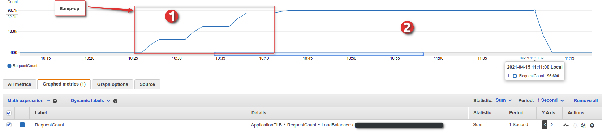

# Vegeta Script

With [Vegeta](https://github.com/tsenart/vegeta) library, you may have already noticed following drawbacks with comparing to other Performance testing tools:

* Unable to print error responses
* No rich graphical representation of the test results

In order to overcome the above concerns, this GO script can be used. This script prints all the error responses (responseErrors.log)
during the test and publish the Raw data of each request to InfluxDB. So, we can use these DATA for further analysis through Grafana Dashboard.

## Before you begin
* Install Go [1.13](https://golang.org/doc/install) or later.

For more information, please refer to the : https://dilshan-fdo.medium.com/publish-vegeta-test-results-to-influxdb-2-0-flux-language-d18f5763c81f

## Features Available

* Include the Ramp-up load before execute the actual load (Load-on-hold)
* Print test results and error responses for both Ramp-up and  actual load execution periods (refer the log and JSON files)
* Publish test results to the InfluxDB 2.0, so user can have a graphical representation of the test results

